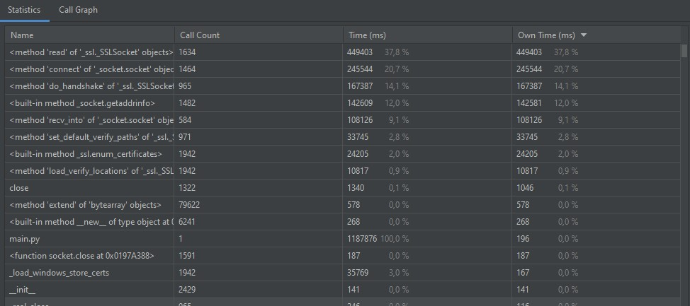
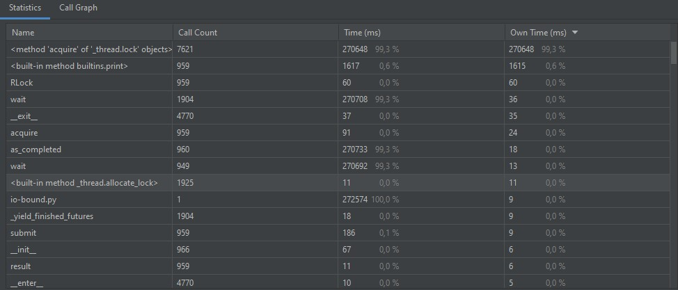
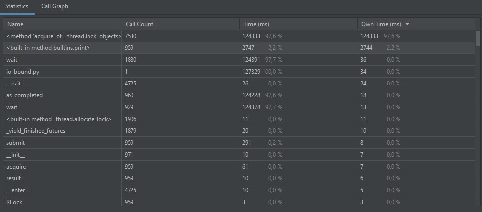
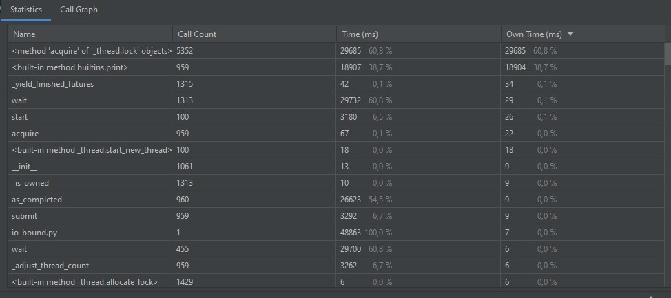
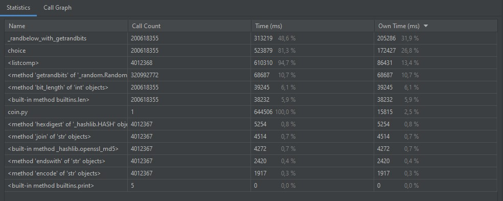
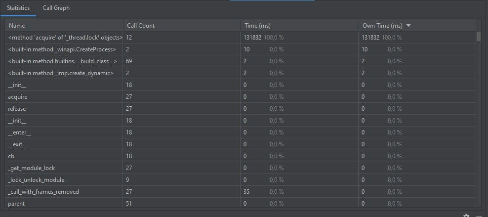
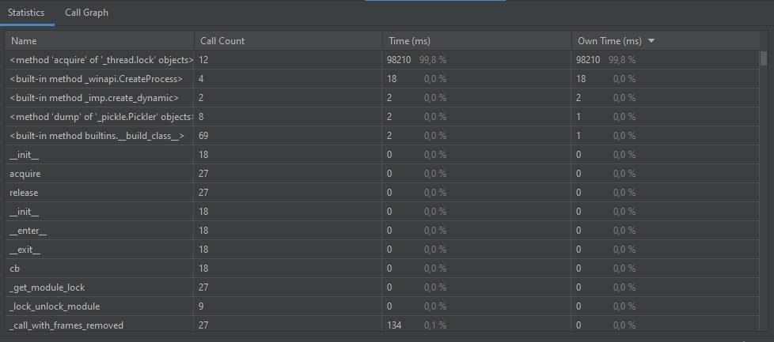
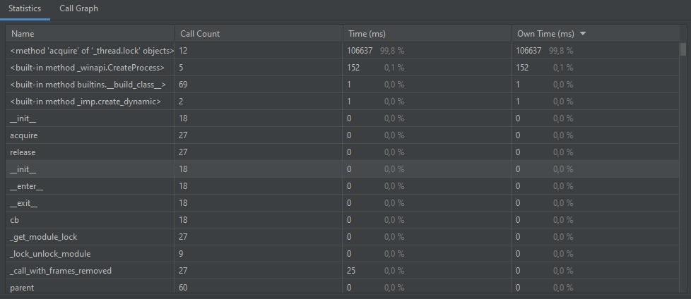
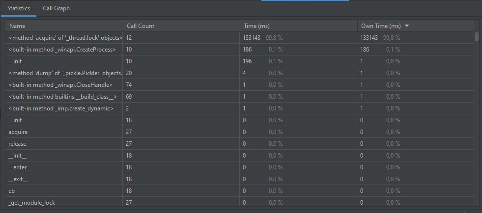

# multi
# IO-bound
## Время работы оригинального скрипта

## Время работы с пятью потоками

## Время работы с десятью потоками

## Время работы со ста потоками

## Выводы
Как можно заметить, с увеличением числа потоков
время работы уменьшается, причем нагрузка на 
систему остается примерно на одном уровне.
----
# CPU-bound

## Время работы оригинального скрипта

Нагрузка на ЦПУ - 30%
---
## Время работы в два процесса

Нагрузка на ЦПУ - 60%
---
## Время работы в четыре процесса

Нагрузка на ЦПУ - 100%
---
## Время работы в пять процессов

Нагрузка на ЦПУ - 100%
---
## Время работы в десять процессов

Нагрузка на ЦПУ - 100%
---
## Время работы в шестьдесят процессов

Нагрузка на ЦПУ - 100%
---
## Выводы
По полученным результатам можно сделать вывод, что время работы 
уменьшается с увеличением числа процессов, пока их число не превышает
число ядер у процессора. После того, как число процессов превысит число
ядер, время работы будет находиться примерно на одном уровне, то уменьшаясь,
то увеличиваясь, т.к. при переборе используются случайно сгенерированные 
значения. Также, с увеличением числа процессов увеличивается нагрузка на
процессор.
